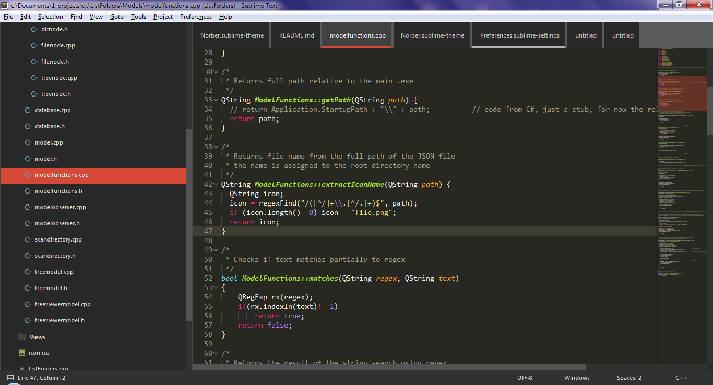

# Norber Theme

A Theme for [Sublime Text](http://sublimetext.com) editor.  
Source themes: [Numix Theme](https://github.com/nauzethc/sublime-text-numix), [Material Theme](https://github.com/equinusocio/material-theme).

Changes:
- Space betweeb tabs;
- Different colors for active/inactive tabs;
- Different hover color for sidebar;
- File icons for sidebar items;
- Changed document tab is highlighted with the bottom light line.

The Theme with **Monokai** color scheme:




# Install

  - Download the Package
  - Unzip the files and rename the folder to **Norber Theme**
  - Find your **Packages** directory using the menu item `Preferences -> Browse Packages...`
  - Copy the folder into your Sublime Text **Packages** directory.
  - Click on `Preferences -> Settings - User` and add the next line:
  
  ```
  "theme": "Norber.sublime-theme"
  ```

# Additional Sublime Settings

  ```
  "always_show_minimap_viewport" : true,
  "show_tab_close_buttons": false,
  "enable_tab_scrolling": false,
  ```

# Changelog

## 1.0.1

- changed fonts for sidebar items and tab labels to **Verdana** for better view
